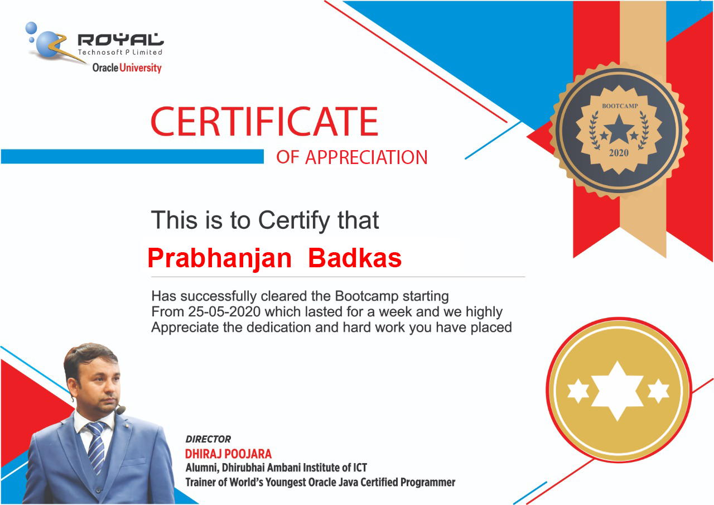

<!DOCTYPE html>
<html>
<head>
	<link rel="stylesheet" type="text/css" href="web.css">
	<meta charset="utf-8">
	<meta name="viewport" content="width=device-width, initial-scale=1">
	<title>HELLO WORLD COURSERA!</title>
</head>
<body>
<h1>Humans On Moon-Again!</h1>

<h3>The Vastuk01 made a successfull landing yesterday at 1745 hrs , 3 astronauts land</h3>

After travelling for over 4 days , dozens of complications and hiccups later , the humans are on the moon again . Only this time , that they're bigger and better equipped and prepared.

</body>
</html>

